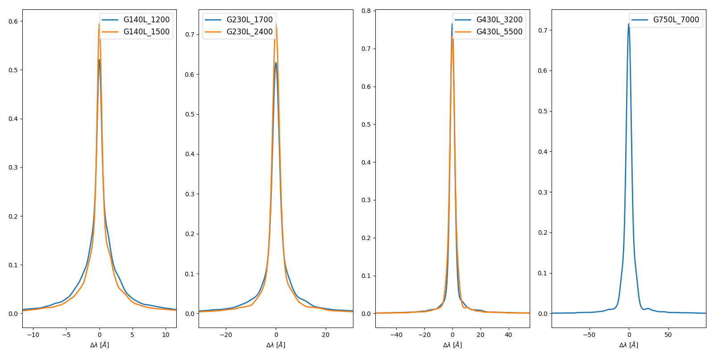
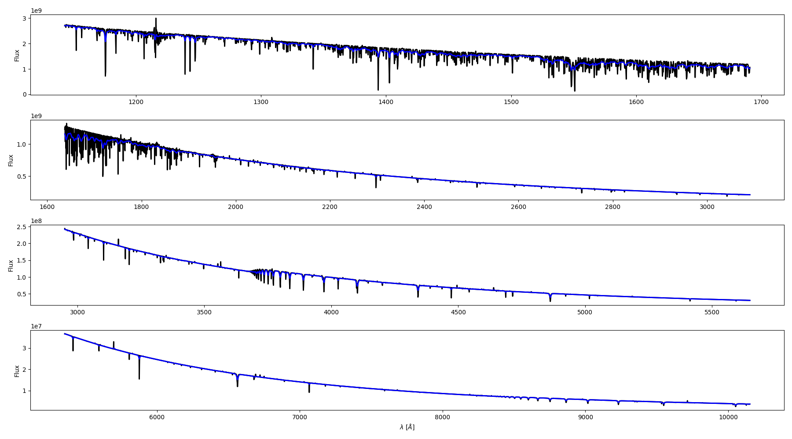

.. _model standards:

===========================
Stellar Models as Standards
===========================

Background
----------

The usual method for measuring dust extinction is to use observations
of two stars with identical spectral types, one that is reddened and one
that is unreddened/lightly reddened.  The unreddened/lightly reddened star
is termed the standard meaning what a star of that spectral type looks like
without foreground dust.  The main pro in using observations for
the standard
is then the resulting extinction measurement only depends on the relative
calibration of the instrument used.  The main con is that getting a "perfect"
match of spectral types is rare and, hence, spectral mismatches impact the
accuracy of the resulting extinction measurements.

Alternatively, stellar atmosphere models can be used for the unreddened
standard stars.  This means that better spectral matching is possible, but
with the cost of now being dependent on the instrumental calibration of the
reddened star observation.  A good reference for using models as standards
is
`Fitzpatrick & Massa (2005) <https://ui.adsabs.harvard.edu/abs/2005AJ....130.1127F/abstract>`_.

In summary:

Using observed standards:

- pro: sensitive to relative calibration only
- pro: empirical matching of stellar physics
- con: requires observations of the reddened and unreddened stars
- con: spectral mismatch between the two stars

Using stellar models for standards:

- pro: better spectral matches
- pro: only need to observe the reddened star
- con: models are approximate at some level (can be missing lines/physics)
- con: dependent on the absolute calibration

Model Fitting
-------------

When using a model as the standard, fitting the observed data can be done to 
determine the stellar and dust extinction parameters.  This is done by using
a grid of stellar atmosphere models with a model for the dust extinction curve.
The model of the dust extinction curve that is often used is a combination of
a FM90 parameterization for the ultraviolet and and a R(V) dependent model for the 
longer wavelengths that are joined with carefully chosen splines.

Fitting is supported through the `ModelData` and `MEModel` classes.  The `ModelData`
class stores the stellar atmosphere mocked data.  The `MEModel` class has all the 
model parameters and functions to compute dust extinguished model data, fit with 
a minimizer or a sampler observed data, and plot the resulting fits including
diagnostic plots.

.. toctree::
   :maxdepth: 2

   Model Details <model_capabilities.rst>

Tlusty Stellar Atmosphere Models
--------------------------------

The
`Ostar <http://tlusty.oca.eu/Tlusty2002/tlusty-frames-OS02.html>`_ and
`Bstar <http://tlusty.oca.eu/Tlusty2002/tlusty-frames-BS06.html>`_
grids of Tlusty stellar atmosphere models
(`Hubeny & Lanz 1995 <https://ui.adsabs.harvard.edu/abs/1995ApJ...439..875H/abstract>`_)
provide good standards, especially of hot, early type stars often used
in extinction studies as they are bright in the ultraviolet.

The `measure_extinction` package provides code to transform the tlusty
SEDs into the same format as the observed data.  In other words, it mocks
the spectroscopy and photometry allowing for models to look like they were
observed.  The specific code is `utils/make_obsdata_from_model.py`.
This code uses the 'merge_obsspec' functions to transform the model SEDs
to the observed spectral formats.
The `utils/make_all_tlusty_obsdata.py` runs on the `*.flux.gz` tlusty files.

Most spectra are simulated/mocked using the appropriate width Gaussian for the 
line-spread-function (LSF).  For some cases, the LSF is known to deviate 
from a Gaussian and then a numerical LSF is used with the details given below.

STIS Mocking
^^^^^^^^^^^^

The HST STIS observations are simulated by convolving the high spectral
resolution model spectra to the STIS resolution using STIS line-spread-fuctions (LSFs)
retrieved from
`STScI <https://www.stsci.edu/hst/instrumentation/stis/performance/spectral-resolution>`_.
These line-spread functions are provided at specific wavelengths and are linearly
interpolated/extrapolated for other wavelengths (see `utils/mock_spectra_data.py`
for details.)

STIS LSFs (52x2 slit):

Example of mocked STIS observations for all four low-resolution grating settings:

